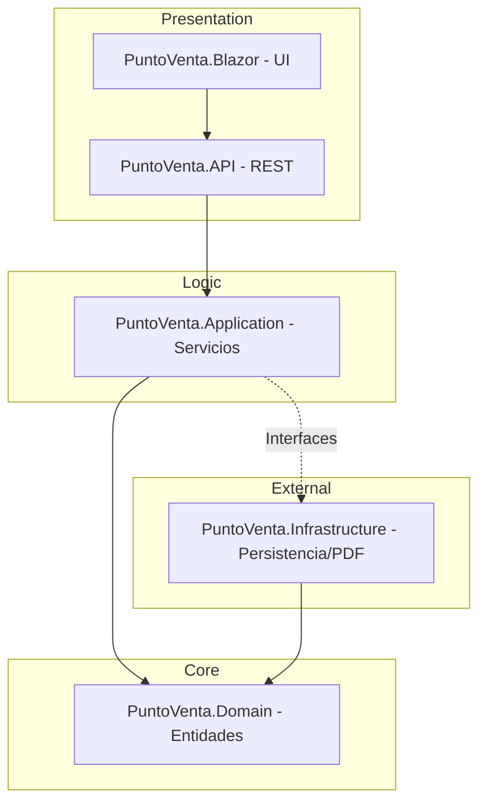

# PuntoVenta - Documentación Técnica y Arquitectónica

Este documento proporciona una visión detallada de la arquitectura, las capas y la funcionalidad del sistema **PuntoVenta**. El proyecto ha sido diseñado siguiendo los principios de **Clean Architecture**, asegurando escalabilidad, mantenibilidad y una clara separación de responsabilidades.

## 1. Visión General de la Arquitectura

El sistema utiliza una arquitectura por capas donde el "Dominio" es el núcleo y las dependencias fluyen hacia adentro. Esto permite que la lógica de negocio sea independiente de las bases de datos o interfaces de usuario.

---

## 2. Desglose de Capas

### 🟢 1. PuntoVenta.Domain (El Corazón)
Es la capa más interna y no tiene dependencias externas. Contiene la lógica esencial que define el negocio.
- **Entities**: Definición de los objetos principales (`Product`, `Sale`, `SaleDetail`, `Customer`).
- **Enums**: Definiciones estandarizadas como `PaymentType` (Cash, Card) y `SaleStatus` (Completed, Voided).
- **Reglas**: Definición de cómo se comportan los datos antes de persistirse.

### 🔵 2. PuntoVenta.Application (Lógica de Negocio)
Orquesta el flujo de datos entre el dominio y las capas externas.
- **Services**: Contiene la lógica de los casos de uso (`ProductService`, `SaleService`, `DashboardService`). Aquí se gestiona la lógica de "Realizar Venta" o "Consultar Dashboard".
- **Interfaces**: Define los contratos que la infraestructura debe implementar (ej. `IUnitOfWork`).
- **DTOs (Data Transfer Objects)**: Objetos optimizados para mover información entre el backend y el frontend.

### 🟡 3. PuntoVenta.Infrastructure (Detalles de Implementación)
Gestiona todo lo relacionado con servicios externos y persistencia.
- **Persistence**: Configuración de Entity Framework Core. Mapeo de entidades a tablas SQL (`Configurations`).
- **Repositories**: Implementación del patrón `UnitOfWork` para asegurar que las ventas sean transaccionales (todo o nada).
- **External Services**: Generación de facturas en PDF utilizando motores de renderizado profesional.

### 🔴 4. PuntoVenta.API (El Puente)
Expone la funcionalidad del sistema a través de endpoints REST.
- **Controllers**: Gestiona las peticiones HTTP y las delega a los servicios de aplicación.
- **Dependency Injection**: Configura cómo se conectan las piezas del sistema al iniciar la aplicación.

### 🟣 5. PuntoVenta.Blazor (Interfaz de Usuario)
La capa de presentación visual, construida con Blazor WebAssembly para una experiencia rápida y moderna.
- **Páginas**: `Sales.razor` (Punto de venta), `Dashboard.razor` (Estadísticas), `Inventory.razor`.
- **Diseño System**: Basado en una estética "Rojo Vino" premium, con soporte para modo oscuro y animaciones fluidas.
- **Iconografía**: Uso de *Phosphor Icons* para una interfaz limpia y profesional.

---

## 3. Flujos Críticos del Sistema

### A. Gestión de Ventas y Stock
Cuando se realiza una venta:
1. El **Blazor** envía el detalle a la **API**.
2. El **SaleService** inicia una **Transacción**.
3. Se valida el stock disponible.
4. Se reduce el stock de forma atómica en la base de datos (evitando errores de concurrencia).
5. Se guarda la venta y sus detalles.
6. Se confirma la transacción.

### B. Generación de Facturas
El sistema genera comprobantes de venta dinámicos que incluyen:
- Datos del cliente.
- Desglose de productos e impuestos.
- Estado de la venta (Completada o Anulada).

---

## 4. Tecnologías Clave

| Tecnología | Propósito |
| :--- | :--- |
| **.NET 8** | Framework principal de ejecución. |
| **C#** | Lenguaje de programación robusto y tipado. |
| **Blazor WASM** | Frontend interactivo del lado del cliente. |
| **EF Core** | ORM para comunicación con la base de datos. |
| **SQL Server / SQLite** | Almacenamiento de datos persistente. |
| **QuestPDF / iText** | Generación de reportes y facturas profesionales. |

---

> [!TIP]
> **Mantenibilidad:** Gracias a esta estructura, si en el futuro decides cambiar la base de datos (ej. de SQL Server a PostgreSQL), solo necesitas modificar la capa de **Infrastructure**, sin tocar ni una sola línea de la lógica de negocio en **Domain** o **Application**.
